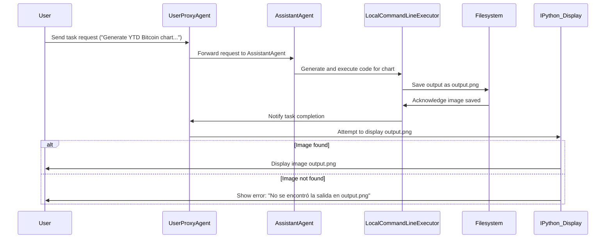
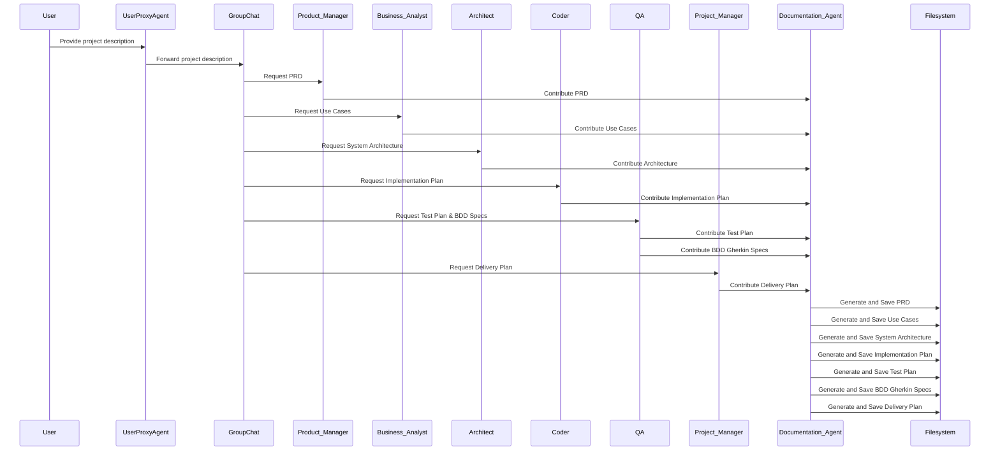

# AI-Agent and Multi-Agent Systems Demos
This repository contains demos created to illustrate the concepts of AI-Agents and Multi-Agent Systems. This project was created as part of the [AI4Devs](https://www.lidr.co/ia-devs) program by [LIDR](https://www.lidr.co/), to understand the orchestration and collaboration of multiple intelligent agents working together to solve tasks.

Author: [Giuseppe Turitto](https://github.com/GTuritto)

---

## Demo1: Bitcoin chart
### Key Components:

1. **User**: The actor who initiates a task request (e.g., generating a chart of Bitcoin prices and volume).
2. **UserProxyAgent**: Acts as an intermediary for the user, managing the task request and handling code execution.
3. **AssistantAgent**: Executes tasks based on the user’s request, in this case, using the Mistral API for language processing.
4. **LocalCommandLineCodeExecutor**: Responsible for executing any code generated to fulfill the user’s request. It operates within a specific directory (`contenido`) to store output files.
5. **Filesystem**: The system's storage where the output (e.g., the image file) is saved.
6. **IPython.display.Image**: A tool used to display the output image in the notebook environment.

### Sequence Flow:

1. **User sends a task request**: The user provides a task (e.g., "Generate the YTD chart of Bitcoin prices and volume in USD and save it as `output.png`").
2. **UserProxyAgent forwards the request to the AssistantAgent**: The request is sent to the AssistantAgent for processing.
3. **AssistantAgent processes the task**: The AssistantAgent processes the request using the configured Mistral API and generates the required code to produce the chart.
4. **LocalCommandLineCodeExecutor executes the code**: The code generated by the AssistantAgent is executed by the LocalCommandLineCodeExecutor, which saves the output as `output.png`.
5. **Filesystem stores the output**: The generated image file is saved in the specified directory (`contenido`).
6. **Displaying the output**: The system attempts to display the generated image using `IPython.display.Image`. If the image is not found, an error message is shown.

### Explanation of Code Flow:

1. **Environment Configuration**:
    - `load_dotenv()` loads environment variables (like API keys) from a `.env` file. These are used for configuring API calls, such as the Mistral API in this case.
2. **API Configuration**:
    - The code uses the Mistral API for natural language processing. The `api_config` defines the API model, token limits, and API key.
    - The `llm_config` includes additional settings such as retry logic (in case of rate limits or timeouts) and consistency in responses using a cache seed.
3. **Agent Initialization**:
    - **AssistantAgent ("Asistente")**: This agent is configured to process user requests concisely. It uses the Mistral API and is designed to minimize follow-up questions.
    - **UserProxyAgent**: This agent proxies the user input and manages the conversation flow. It controls how many interactions occur before termination (maximum 5), and when the task is completed (either by explicit termination or the phrase "tarea completada").
    - It also configures the **LocalCommandLineCodeExecutor**, which runs any generated code and saves the result in the specified directory (`contenido`).
4. **Task Request**:
    - The user sends a task request (`task_request`) to generate a Bitcoin chart.
    - The **UserProxyAgent** initiates a chat with the **AssistantAgent**, forwarding this task.
5. **Code Execution**:
    - The **AssistantAgent** processes the task and generates the appropriate code, which is then executed by the **LocalCommandLineCodeExecutor**.
    - The code generates an image (in this case, a chart) and saves it as `output.png` in the `contenido` directory.
6. **Displaying the Result**:
    - The system attempts to display the image using `IPython.display.Image`. If the image file (`output.png`) is found, it is displayed. Otherwise, the system prints an error message indicating that the file was not found.

### Summary:

This code defines an AI-driven task execution framework where the **UserProxyAgent** acts on behalf of the user, forwarding tasks to the **AssistantAgent**, which generates and executes code to fulfill the task. The **LocalCommandLineCodeExecutor** executes the code, and the result is saved and displayed. If the output is unavailable, the user is informed of the error.

---

## Demo2: Product Documenter
### Key Components:

1. **User**: Initiates the project request by providing a description.
2. **UserProxyAgent**: Represents the user and forwards the project description and requests to other agents.
3. **Project Manager (PM)**: Responsible for creating a detailed delivery plan with milestones, timelines, and resource allocation.
4. **Product Manager (Product_Manager)**: Creates the Product Requirements Document (PRD) detailing the project's features and objectives.
5. **Business Analyst (BA)**: Document use cases and create a diagram of them.
6. **Architect**: Designs the system architecture using C4 and Mermaid diagrams.
7. **Coder**: Prepares a detailed implementation plan focusing on best coding practices and efficient algorithms.
8. **QA**: Creates a testing plan, including functional, integration, and regression testing, and provides BDD specifications in Gherkin.
9. **Documentation Agent**: This person is responsible for compiling contributions from other agents and generating the final project documentation.
10. **GroupChat**: Coordinates and manages communication among agents during the project.
11. **GroupChatManager**: Orchestrates the workflow of the group chat, ensuring smooth communication and task execution.

### Sequence Flow:

1. **User provides a project description**: The user is asked to describe the project.
2. **UserProxyAgent forwards the project description**: The description is passed to the group chat, where different agents contribute based on their roles.
3. **Phase 1: Contributions from various agents**:
    - **Product Manager** contributes the PRD.
    - **Business Analyst** contributes use cases and a use case diagram.
    - **Architect** contributes to the system architecture.
    - **Coder** contributes an implementation plan.
    - **QA** contributes to the testing plan and BDD specifications.
    - **Project Manager** contributes to the delivery plan.
4. **Documentation Agent compiles the contributions**: The documentation agent collects all contributions from the agents.
5. **Asynchronous document generation**: The documents are generated asynchronously for each section (PRD, use cases, architecture, implementation plan, etc.).


### Explanation of the Code Flow:

1. **Loading environment variables**: The code first loads environment variables from a `.env` file using `load_dotenv()`. These variables are used to configure the API keys for the Mistral and OpenAI APIs.
2. **LLM Configuration**: Three configurations for the language model (LLM) are created with different temperature settings (`high`, `normal`, and `low`), each representing different creativity levels (e.g., higher temperature for creative tasks, lower temperature for structured tasks).
3. **Agent Initialization**: Various agents are initialized, each responsible for a specific aspect of the project. The agents are configured using the Mistral API and their respective system messages, which define their responsibilities.
    - **UserProxyAgent**: Handles user requests and code execution.
    - **Product Manager, Business Analyst, Architect, Coder, QA, Project Manager**: Specialized agents contribute to different project documents.
    - **Documentation Agent**: Collects contributions and generates the final project documents.
4. **Group Chat and Manager Setup**: The group chat and manager (`GroupChatManager`) are initialized, managing the agents' interactions and communications.
5. **Project Workflow**:
    - The project workflow starts when the user provides a description of the project.
    - The `UserProxyAgent` sends this description to the group chat, prompting contributions from various agents.
    - Each agent contributes content (e.g., PRD, use cases, architecture) to the **Documentation Agent**, which compiles everything.
    - The contributions are generated asynchronously and saved to the filesystem as markdown files.
6. **Asynchronous Document Generation**: The final project documents are generated asynchronously, ensuring non-blocking execution and allowing agents to work simultaneously.

### Summary:

This code sets up a collaborative environment where multiple AI agents contribute to different aspects of a project (e.g., planning, documentation, testing). The agents operate in phases, and their outputs are compiled into a final set of project documents. The asynchronous execution ensures efficient handling of multiple tasks, while retries and error handling provide resilience in the process.


## Demo 3: AI-parrot, automating AI News Podcast Creation with LangGraph

AI-parrot is a demo project that leverages LangGraph's power to automate podcast generation using the latest AI news. AI-parrot handles it all using intelligent agents, from fetching and ranking news articles to generating a professional podcast script and converting it to audio. This project highlights LangGraph's flexibility and capabilities in building sophisticated agent-based workflows.

### Key Features
- **Automated News Fetching:** Fetches the latest AI news from trusted sources and selects relevant articles.
- **Article Ranking:** It utilizes AI to rank news articles based on recency and relevance to artificial intelligence.
- **Script Generation:** Automatically generates a podcast script using AI agents in a friendly, conversational style.
- **AI-Powered Script Revision:** Refines the script to ensure it’s engaging, polished, and ready for a radio show.
- **Text-to-Speech Conversion:** Converts the podcast script to an MP3 format using TTS services, ready for sharing.
  
### Why This Project?
This project was created as part of the [AI4Devs](https://www.lidr.co/ia-devs) for [LIDR](https://www.lidr.co/) course to showcase LangGraph's potential and how it can be used to automate complex workflows, such as content generation and audio production. It’s designed to be a hands-on demo, offering a practical application of agent-based systems, and will continue to evolve as new features are added.

### What’s Next?
AI-parrot is far from finished! As the project grows, expect to see:

- **New sources for AI news:** Expanding beyond current sources to include a broader range of content.
- **Advanced ranking models:** Incorporating more sophisticated ranking algorithms to improve relevance scoring.
- **Dynamic script generation:** Adding the ability to tweak podcast scripts based on audience preferences.
- **More customization options:** Allowing users to modify the podcast tone and style with even more granularity.
- **Support for MultiLLM:** Why only use one LLM instead of the right one for the task.
- **Integration with Workflow Platforms:** Integrating with platforms like Zapier can allow us to schedule and automate the publishing.

Stay tuned, as AI-parrot will continue to evolve!


## How to Get Started

You have 2 options:
- Run it in Google Colab for an easier setup and customization
- Run it locally to have a more real experience

First, clone the repository:

```bash
git clone https://github.com/LIDR-academy/AI4Devs-multiagents
cd AI4Devs-multiagents
```

### 1. Running the projects in Google Colab
You just need to upload *.ipynb files to Google Drive, and open from there, or go to https://colab.research.google.com/ and upload there, or just open the file in your IDE and click on the button "Open in Colab" at the beginning.

Once there, just click on the different steps to progress.

### 2. Running the projects locally

Once you have cloned the repository:

1. Install the dependencies:

```bash
pip install -r requirements.txt
```

2. Set up environment variables by creating a .env file with your API keys:

```makefile
MISTRAL_API_KEY=<your-mistral-api-key>
```

You can obtain the API key for Mistral at <https://console.mistral.ai/api-keys/>. So, as you know, you will need a Mistral.ai account. Also, you can use OpenAI API-Key to use OpenAI GPT4o (or any other) as the LLM or even a combination of both.

You can obtain the API key for Mistral at <https://console.mistral.ai/api-keys/>. So, as you know, you will need a Mistral.ai account.
Also, you can use OpenAI API-Key to use OpenAI GPT4o (or any other) as the LLM or even a combination of both.

For the News API key in the Demo 3, you will need to request one at <https://newsapi.org/>

```makefile
MISTRAL_API_KEY=<your-mistral-api-key>
NEWS_API_KEY=<your-news-api-key>
```

3. Run the desired project, e.g. Demo2:
```bash
python Demo2-documenter.py
````


## Contributing
This project is open for contributions! Please submit pull requests, raise issues, or suggest any features. Your feedback is invaluable.
